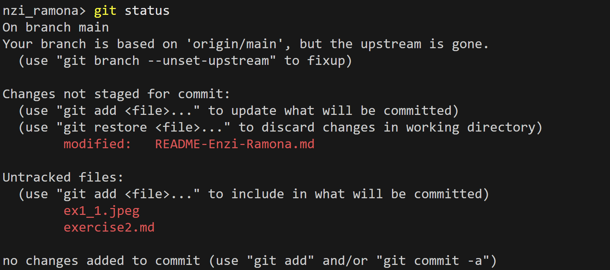
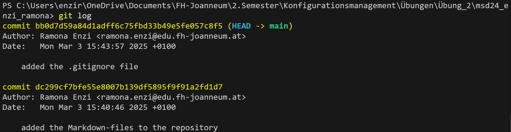

# Übung 2

## Übersicht

In dieser Übung geht es darum, ein eigenes Github-Repository zu erstellen und dieses auf den eigenen PC zu klonen. Anschließend fügt man in dieses Repository mehrere Dateien, wobei einige mit dem .gitignore nicht hinzugefügt werden.

## Git-Befehle mit Beschreibung

|Befehl|Beschreibung|
|:------:|:------------:|
|git config | zum konfigurieren der Benutzereinstellungen, z.B. Name und E-Mail|
|git init | initialisiert ein Git-Repository in dem aktuellen Ordner|
|git commit | speichert die Änderungen im Repository mit einer angemessenen Nachricht|
|git status | zeigt den Status des Arbeitsverzeichnisses und der Staging-Area|
|git add | fügt Dateien zur Staging-Area hinzu|
|git log | zeigt alle bisherigen Commits im Repository|
|git diff | vergleicht die Änderungen verschiedener Versionen|
|git pull | holt und fügt Änderungen des Remote-Repositories hinzu|
|git push | überträgt Änderungen auf das Remote-Repository|

## Einige Bilder als Beispiel

**git status:**

**git log:**

